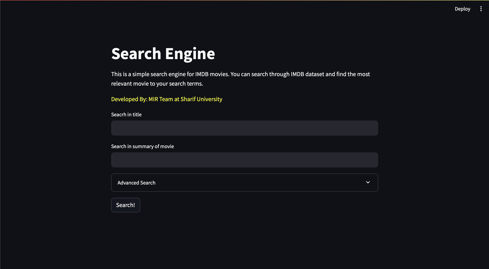

# UI Module


This module contains files and classes responsible for the user interface of the project. The explanations of each class and what it does is provided below (and will be completed as the project goes on).

## Installing Required Packages
To install the required packages, you can run the following command:
```bash
pip install -r requirements.txt
```

## Running the Project
To run the project, you can run the following command:
```bash
streamlit run main.py
```
and then head to your browser and open `http://localhost:8501/` (or whatever port that is written in your terminal by streamlit) to see the user interface.
